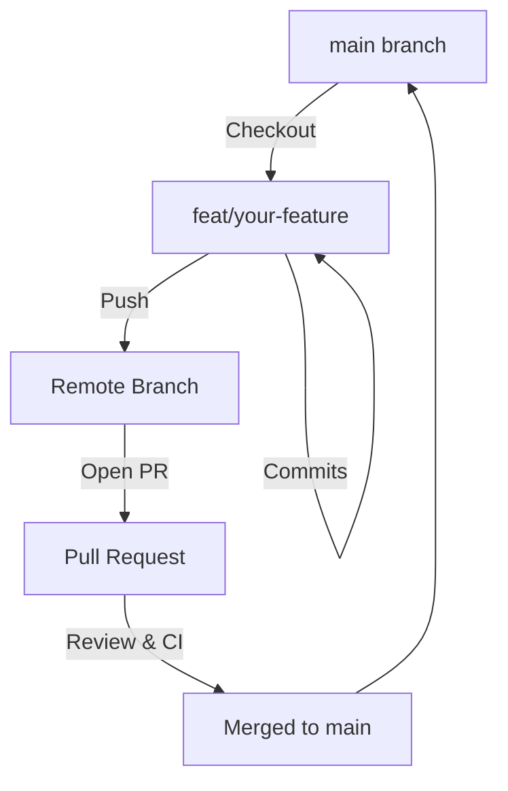

# Contributing to RemitLend

First off, thank you for considering contributing to RemitLend! It's people like you who make RemitLend a powerful tool for providing fair lending access to migrant workers worldwide.

This document provides a set of guidelines for contributing to RemitLend and its packages. These are mostly guidelines, not rules. Use your best judgment, and feel free to propose changes to this document in a pull request.

## 📋 Table of Contents

- [Code of Conduct](#code-of-conduct)
- [Development Workflow](#development-workflow)
- [Branching Strategy](#branching-strategy)
- [Commit Message Guidelines](#commit-message-guidelines)
- [Pull Request Standards](#pull-request-standards)
- [Environment Variables](#environment-variables)
- [Testing Requirements](#testing-requirements)
- [Style Guides](#style-guides)

## Code of Conduct

By participating in this project, you agree to maintain a respectful, inclusive, and harassment-free environment for everyone. We are committed to providing a welcoming experience for contributors of all backgrounds and skill levels.

## Development Workflow

We follow a **Feature-Branch-to-Main** workflow. All development work should happen in feature branches and be merged into `main` via Pull Requests.

### Architecture & Contributor Wiki

If you're new to the codebase, start with:
- `docs/wiki/README.md` (high-level contributor wiki)
- `ARCHITECTURE.md` (system overview)
- `docs/deployed-contracts.md` (testnet/mainnet contract IDs and the env vars that consume them).



### Steps to Contribute

1. **Fork & Clone**: Fork the repository and clone it locally.
2. **Branch**: Create a new branch from the latest `main`.
3. **Develop**: Implement your changes, following code style and quality standards.
4. **Test**: Ensure all tests pass (see [Testing Requirements](#testing-requirements)).
5. **Commit**: Use [Conventional Commits](#commit-message-guidelines).
6. **Push & PR**: Push your branch and open a Pull Request against `main`.

## Branching Strategy

Follow these naming conventions for your branches:

| Type | Prefix | Example |
| :--- | :--- | :--- |
| **Feature** | `feat/` | `feat/lender-dashboard` |
| **Bug Fix** | `fix/` | `fix/nft-minting-error` |
| **Docs** | `docs/` | `docs/update-api-guide` |
| **Refactor** | `refactor/` | `refactor/loan-logic` |
| **Performance**| `perf/` | `perf/optimize-queries` |
| **Maintenance**| `chore/` | `chore/update-deps` |

## Commit Message Guidelines

We strictly follow the [Conventional Commits](https://www.conventionalcommits.org/) specification.

**Format**: `<type>(<scope>): <subject>`

### Common Types:

- **feat**: A new feature (corresponds to `MINOR` in Semantic Versioning).
- **fix**: A bug fix (corresponds to `PATCH` in Semantic Versioning).
- **docs**: Documentation only changes.
- **style**: Changes that do not affect the meaning of the code (white-space, formatting, etc).
- **refactor**: A code change that neither fixes a bug nor adds a feature.
- **perf**: A code change that improves performance.
- **test**: Adding missing tests or correcting existing tests.
- **chore**: Changes to the build process or auxiliary tools and libraries.

**Example**: `feat(contracts): add flash loan prevention to lending pool`

## Pull Request Standards

When opening a PR, ensure your description includes:
- **Linked Issue**: Close the relevant issue (e.g., `Closes #123`).
- **Description**: A clear summary of the changes.
- **Testing**: Evidence that the changes were tested.
- **Checklist**:
    - [ ] Code follows project style guides.
    - [ ] Tests have been added/updated and pass.
    - [ ] Documentation has been updated.
    - [ ] Commit messages follow standards.

## Environment Variables

Before setting up the project locally, review the full environment variable reference in [docs/ENVIRONMENT.md](docs/ENVIRONMENT.md). Each `.env.example` file contains a pointer to this canonical reference. If you add a new environment variable, update both the relevant `.env.example` and the table in `ENVIRONMENT.md`.

## Testing Requirements

Before submitting, verify your changes by running:

### Frontend (Next.js/React)
```bash
cd frontend
npm run lint
npm run test
```

### Backend (Node/Express)
```bash
cd backend
npm run lint
npm run test
```

### Contracts (Soroban/Rust)
```bash
cd contracts
cargo fmt --check
cargo clippy
cargo test
```

### Smart Contracts Fuzzing (Soroban)
For consensus-critical changes to smart contracts, fuzz testing is an expected part of the workflow.

Refer to [`contracts/FUZZING_README.md`](contracts/FUZZING_README.md) for full setup instructions, invariant definitions, and running fuzz campaign scripts (`./fuzz_campaign.sh`).

## Accessibility Requirements

RemitLend serves migrant workers on a wide range of devices and assistive
technologies, so accessibility is a correctness requirement, not a nice-to-have.

**Baseline expectations for every frontend change:**

- Meet **WCAG 2.1 Level AA**. Every interactive element must be reachable and
  operable by keyboard, expose an accessible name, and show a visible focus ring.
- Respect the existing focus-management and `prefers-reduced-motion` conventions
  in `src/app/[locale]/globals.css`.
- Provide text alternatives for icons and charts; never encode meaning in colour
  alone.
- Reuse the shared primitives (`components/ui/floating` for tooltips/popovers,
  `components/ui/Modal`, etc.) rather than re-implementing focus traps and ARIA
  wiring.

**Charts and data visualisations:**

- Every chart must ship an accessible data table that exposes the same values as
  the visualisation. Render it with the shared `ChartDataTable` primitive
  (`components/charts/ChartDataTable`) so the table is visually hidden by default
  but remains in the accessibility tree, and is reachable via a visible
  "View as table" toggle.
- Chart elements (bars, points, slices, legend entries) must be keyboard
  navigable: focusable with `Tab`, traversable with the arrow keys, and
  activatable with `Enter`/`Space` where the element has an action. Announce the
  focused datum through an `aria-live` region or `aria-describedby`.
- Bound the rendered table: cap rows at the shared `MAX_CHART_TABLE_ROWS` limit
  and paginate or virtualise beyond it so large datasets cannot exhaust the DOM.
- Add a focused test for each chart covering the table contents, keyboard
  traversal, and the row cap.

**Automated checks:**

- The **Accessibility** GitHub Actions workflow (`.github/workflows/a11y.yml`)
  runs axe-core against critical pages via `e2e/a11y.spec.ts` and **fails the PR
  on any new WCAG A/AA violation**. Run it locally with:

  ```bash
  cd frontend
  npm run build
  npx playwright test e2e/a11y.spec.ts --project=chromium
  ```

- When adding a new top-level page, add its route to `CRITICAL_PAGES` in
  `e2e/a11y.spec.ts`.
- Storybook ships the **@storybook/addon-a11y** panel; check it while developing
  components in isolation (`npm run storybook`).
- For live feedback while running the dev server, enable the in-browser axe
  overlay by rendering `@axe-core/react` from a client component in development
  only (dependency already declared in `frontend/package.json`).

## Visual Regression Requirements

Critical financial states must not change visually without an explicit,
reviewable diff. Visual regression coverage lives alongside the Playwright e2e
suite and runs in CI.

**What counts as a critical financial state:**

- Loan amounts, outstanding balances, accrued interest, and repayment
  schedules.
- Transaction lifecycle states: pending, submitted, confirmed, failed, and
  retried.
- Stale or unavailable data (dependency failure) and authorization failure
  states.
- Boundary values: zero, minimum, and maximum representable amounts.

**Rules for visual regression tests:**

- Derive every displayed amount, status, and chain state from the same
  authoritative source the app uses at runtime (API/contract responses or the
  shared financial formatting utilities). **Never hard-code or mock financial
  arithmetic in a story or snapshot** — a mocked number can silently diverge
  from production.
- Cover the success path plus the failure paths listed above (authorization
  failure, boundary values, retries, stale data, dependency failure) for each
  critical financial surface you touch.
- Keep snapshots deterministic: pin the viewport, freeze time and locale, and
  disable animations (`prefers-reduced-motion`) so diffs reflect real changes
  only.
- When a visual change is intentional, update the baseline in the same PR and
  call it out in the PR description with before/after images.

**Running locally:**

```bash
cd frontend
npm run build
npx playwright test e2e/visual --project=chromium --update-snapshots
```

Omit `--update-snapshots` to verify against the committed baselines the way CI
does. New critical financial surfaces must add their route/state to the visual
regression suite in the same PR that introduces them.

## Style Guides

- **TypeScript**: Use functional components and hooks. Prefer `interface` over `type`. Ensure strict typing.
- **Rust**: Follow standard Rust naming conventions and maintain idiomatic code.

---
Thank you for contributing to RemitLend! 🚀
