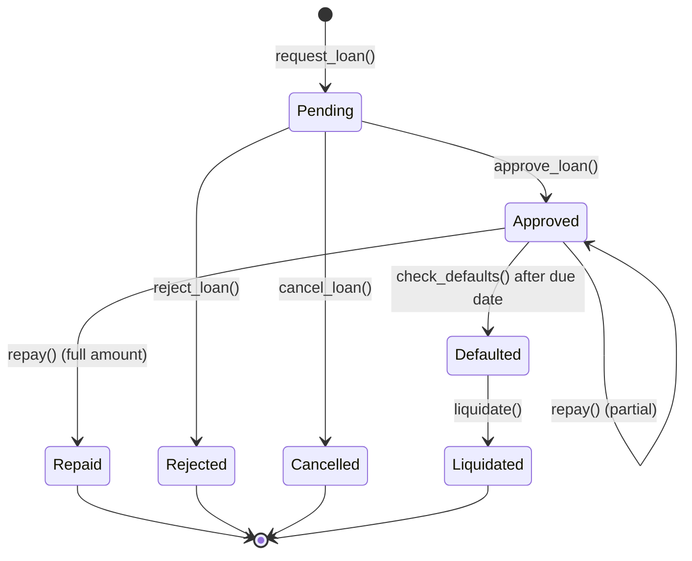

# RemitLend Domain and State-Machine Reference

Canonical reference for every stateful domain object in RemitLend: the states it
can be in, how it moves between them, who is allowed to move it, what happens
when a transition fails, and which layer is authoritative for the status a user
sees.

This document is the single place to look when a status looks wrong. Each
section names the code that owns the truth so it can be re-verified, and
`backend/src/__tests__/domainStateMachineDocs.test.ts` fails the build if the
states documented here drift from the contract enum, the database check
constraints, or the referenced files.

- [Layer model](#layer-model)
- [Loan lifecycle](#loan-lifecycle)
- [Transaction submission and chain confirmation](#transaction-submission-and-chain-confirmation)
- [Remittance records](#remittance-records)
- [Notifications](#notifications)
- [Webhook delivery](#webhook-delivery)
- [Indexer and checkpoints](#indexer-and-checkpoints)
- [Emergency pause](#emergency-pause)
- [Cross-layer invariants](#cross-layer-invariants)
- [Failure, retry, and rollback matrix](#failure-retry-and-rollback-matrix)
- [Verification](#verification)

---

## Layer model

```
Soroban contracts        backend (indexer + API)              clients
─────────────────        ────────────────────────             ───────
LoanStatus (canonical) ─► indexed events ─► loan_history  ─►  LoanStatusBadge
                                            loan_events       (active/pending/
                                                               repaid/defaulted/
                                                               liquidated)
```

| Layer | Authority | Where |
| --- | --- | --- |
| On-chain loan state | **Canonical** for loan existence and lifecycle | `contracts/loan_manager/src/lib.rs` (`LoanStatus`) |
| Chain transaction outcome | **Canonical** for "did this transaction happen" | `backend/src/services/sorobanService.ts` (`submitSignedTx` → `pollTransaction`) |
| Indexed/derived state | Projection of chain state, never a substitute | `backend/src/services/eventIndexer.ts`, `loan_events`, `loan_history` |
| User-visible status | Derived from the projection; contract state always wins on conflict | `backend/src/controllers/*`, `frontend/src/app/components/ui/LoanStatusBadge.tsx` |

Rules that follow from the layer model:

1. **Chain state is authoritative.** Reconciliation
   (`scoreReconciliationService`, `crossContractReconciler`, `defaultChecker`)
   exists to pull projections back towards the chain — never the other way
   around.
2. **Derived state is never invented.** A status only reaches a client if an
   indexed event, a contract read, or a confirmed transaction produced it.
3. **Money is stored in stroops as integers** (`backend/src/money/decimal.ts`,
   `contracts/money/src/policy.rs`); no state above carries a floating-point
   amount.


---

## Loan lifecycle

**Source of truth:** `contracts/loan_manager/src/lib.rs` (`pub enum LoanStatus`).

| State | Terminal | Meaning |
| --- | --- | --- |
| `Pending` | no | Borrower requested funds; awaiting admin decision. |
| `Approved` | no | Funds disbursed from the lending pool; repayment outstanding. |
| `Repaid` | yes | Repayment(s) settled the loan in full. |
| `Defaulted` | yes | `check_defaults` fired after the due date. |
| `Liquidated` | yes | Collateral was seized to cover an unrecovered default. |
| `Cancelled` | yes | Withdrawn by the borrower before approval. |
| `Rejected` | yes | Declined by an admin with a reason. |



### Transition contract

| Transition | Trigger | Authorization | On success | On failure |
| --- | --- | --- | --- | --- |
| `→ Pending` | `request_loan` | `borrower.require_auth()` | Loan persisted, `LoanRequested` emitted | Reverts: no partially created loan (single Soroban transaction) |
| `Pending → Approved` | `approve_loan` | `admin.require_auth()` | Tokens transferred pool → borrower, `LoanApproved` emitted | Reverts: stays `Pending`, no transfer |
| `Pending → Rejected` | `reject_loan` | `admin.require_auth()` | Reason stored, `LoanRejected` emitted | Reverts: stays `Pending` |
| `Pending → Cancelled` | `cancel_loan` | `borrower.require_auth()` | `LoanCancelled` emitted | Reverts: stays `Pending` |
| `Approved → Repaid` | `repay` (full) | `borrower.require_auth()` | Cross-contract score update, `LoanRepaid` emitted | Reverts: prior repayments preserved, stays `Approved` |
| `Approved → Defaulted` | `check_defaults` | permissionless after due date | `LoanDefaulted` emitted, score penalty applied | Reverts: stays `Approved` until a successful call |
| `Defaulted → Liquidated` | `liquidate` | `admin.require_auth()` | Collateral seized, `CollateralLiquidated` emitted | Reverts: stays `Defaulted` |

> Partial repayments leave the loan in `Approved`. Only a repayment that clears
> the outstanding balance — principal plus accrued interest — moves a loan to
> `Repaid`. The backend therefore never infers "repaid" from "a repayment
> happened"; it reads the resulting status.

### Projection into the backend and UI

| On-chain state | `loan_history.status` | `loan_events` / webhook event | UI badge |
| --- | --- | --- | --- |
| `Pending` | `PENDING` | `LoanRequested` | `pending` |
| `Approved` | `OPEN` | `LoanApproved` | `active` |
| `Repaid` | `REPAID` | `LoanRepaid` | `repaid` |
| `Defaulted` | `DEFAULTED` | `LoanDefaulted` | `defaulted` |
| `Liquidated` | `LIQUIDATED` | `CollateralLiquidated` | `liquidated` |
| `Cancelled` | `CANCELLED` | `LoanCancelled` | rendered raw |
| `Rejected` | `REJECTED` | `LoanRejected` | rendered raw |

Rule of thumb: if the UI shows `active`, the chain says `Approved`; if the chain
says `Repaid`, no client may keep showing `active`. The staleness window is
bounded by the indexer poll interval (`INDEXER_POLL_INTERVAL_MS`, default 30s),
which is why the submitting request additionally reports the transaction's own
confirmed status (next section) instead of waiting for the indexer.


---

## Transaction submission and chain confirmation

**Source of truth:** `backend/src/services/sorobanService.ts` (`submitSignedTx`),
Stellar RPC `sendTransaction` / `pollTransaction` result values.

| State | Terminal | Meaning | User-visible |
| --- | --- | --- | --- |
| `submitted` | no | `sendTransaction` accepted the envelope and returned a hash. | "Waiting for confirmation…" |
| `SUCCESS` | yes | Ledger included the transaction and it succeeded. | Success + tx hash |
| `FAILED` | yes | Ledger included the transaction and it failed on-chain. | Failure with tx hash |
| `NOT_FOUND` | yes (for this poll window) | No result within the polling window. | "Still pending" — re-query, never "failed" |
| `ERROR` / `TRY_AGAIN_LATER` | yes | Rejected at submission (bad sequence, fee, or congestion). | Error with the RPC status |

- **Authorization:** the transaction is signed by the wallet (or an admin keypair
  for admin flows) before it reaches the API; the API never signs for a user.
- **Retry:** `pollTransaction` polls up to 30 attempts at 1s intervals.
  `TRY_AGAIN_LATER` is returned to the caller as retryable; the client decides
  whether to resubmit with a fresh attempt.
- **Dependency failure (RPC down/timeout):** the original error is re-thrown to
  the caller after being counted as `status="error"` in
  `chain_confirmation_total` / `chain_confirmation_duration_seconds` with the
  trace id attached, so an RPC outage is distinguishable from an on-chain
  failure in dashboards.
- **Observability:** outcomes are labelled from a bounded set — `success`,
  `failed`, `not_found`, `unknown`, `error` — and every log line carries
  `traceId`, `spanId`, and the outbound `traceparent`.
- **Rollback:** a confirmed transaction is never rolled back client-side.
  Recovery is a compensating transaction (e.g. a new `repay`, or an admin
  correction) plus the reconcilers that re-read contract state.

### Observability: trace context

A single wallet action is traced end to end with W3C Trace Context (#414):

| Hop | Where the trace is created / forwarded |
| --- | --- |
| Wallet → browser API calls | `frontend/src/app/lib/traceContext.ts` via `apiFetch` (`traceparent` header) |
| Next.js BFF → backend | `frontend/src/app/api/recipients/[id]/reveal/route.ts` forwards a child span |
| Inbound API request | `backend/src/middleware/traceContext.ts` (continues or starts a trace; echoes `traceparent`) |
| Indexer pass | `eventIndexer.processChunk` runs each chunk in its own traced context |
| Chain confirmation | `sorobanService.submitSignedTx` derives a child span per submission |
| Outbound webhooks | `traceparent` header on every delivery (`webhookDeliveryService`, `webhookService`) |

Invalid or oversized `traceparent` values are rejected softly (the request
proceeds with a fresh trace) and counted as
`trace_context_requests_total{source="invalid"}`.

---

## Remittance records

**Source of truth:**
`backend/migrations/1779000000009_create-remittances-table.js`
(`check: "status IN ('pending', 'processing', 'completed', 'failed')"`).

```
pending ──► processing ──► completed
                 │
                 └──────► failed
```

| State | Meaning | Allowed next states |
| --- | --- | --- |
| `pending` | Created, not yet submitted for processing. | `processing`, `failed` |
| `processing` | Submitted; awaiting a terminal outcome. | `completed`, `failed` |
| `completed` | Terminal success. | — |
| `failed` | Terminal failure; a retry uses a new record. | — |

Retries create a **new** remittance record (with an idempotency key) rather than
resurrecting a `failed` row, so history is never rewritten and the financial
record stays auditable. Amounts are stored as integer stroops.

---

## Notifications

**Source of truth:**
`backend/migrations/1783000000013_notifications-add-status.js`
(`CHECK (status IN ('unread', 'read', 'archived'))`).

```
unread ──► read ──► archived
   └──────────────────┘
```

| State | Meaning | Transitions |
| --- | --- | --- |
| `unread` | Delivered to the inbox, not yet opened. | → `read`, → `archived` |
| `read` | User opened it (idempotent — repeats are no-ops). | → `archived` |
| `archived` | Hidden from the default inbox; retained until purge. | — |

Retention is time-bounded (`NOTIFICATION_RETENTION_DAYS`,
`READ_NOTIFICATION_RETENTION_DAYS`), so archiving is not deletion. Digest

---

## Webhook delivery

**Source of truth:** `backend/src/services/webhookService.ts`,
`backend/src/services/webhookRetryProcessor.ts`, migrations
`1778000000008_webhook-retry-logic.js` and `1786000000016_webhook-max-attempts.js`.

```
pending ──► delivered
   │
   └─► retrying (attempt_count < max_attempts) ──► failed (attempts exhausted)
```

| State | Meaning | Behaviour |
| --- | --- | --- |
| `pending` | Persisted, not yet attempted. | A worker picks it up on the next tick. |
| `delivered` | Subscriber returned 2xx. | Terminal. |
| `retrying` | Non-2xx or transport failure with attempts remaining. | Exponential backoff; `attempt_count` and `last_status_code` updated. |
| `failed` | Attempts exhausted. | Terminal; reflected in the retry-queue-depth metric. |

Signature verification is the subscriber's responsibility (see
[webhooks.md](webhooks.md)). Every delivery carries a `traceparent`, so a
subscriber can correlate the call with the event that caused it.

---

## Indexer and checkpoints

**Source of truth:** `backend/src/services/eventIndexer.ts`,
`backend/src/services/ledgerCheckpoints.ts`, the `indexer_state` and
`ledger_checkpoints` tables.

| Object | States | Notes |
| --- | --- | --- |
| Indexer cursor (`indexer_state.last_ledger`) | monotonically increasing ledger number | Advances only after a chunk is stored; `GREATEST()` guards make rewinds impossible. |
| Indexed event | `stored` or `quarantined` | Events that fail validation/decoding are quarantined (`1778000000008_quarantine-events.js`) rather than dropped, and can be replayed. |
| Ledger checkpoint | `verified` or `suspect` (`1802000000000_create-ledger-checkpoints.js`) | `suspect` forces reconciliation against chain state before the cursor is trusted. |

Failure behaviour: a failed chunk leaves the cursor untouched, so the same range
is retried on the next pass (at-least-once); inserts are idempotent on event id,
so replays do not duplicate events.

---

## Emergency pause

**Source of truth:** `backend/src/middleware/pauseGuard.ts`,
`backend/migrations/1801000000000_create-pause-state-table.js`, and the global
`Paused` flag in the contracts.

```
unpaused ──► paused ──► unpaused
```

- While **paused**, every state-mutating API request is rejected before it can
  reach the chain; read paths keep working so users can see why.
- Entering or leaving the paused state is an admin action and is written to the
  audit log (`audit_logs`) with actor and reason.
- The chain flag is authoritative: if the API and the chain disagree (for
  example after a partial migration), the chain wins and the API state is
  reconciled from indexer events.

---

## Cross-layer invariants

These hold at every point in time:

1. **No floating point in money paths.** Amounts are integer stroops end to end
   (`money-policy.json` → generated policy files → contracts and backend).
2. **Chain state wins.** Any projection that disagrees with a contract read is
   corrected towards the chain by a reconciler, never the reverse.
3. **Derived status never moves backwards** for a loan lifetime (`Repaid` never
   becomes `Approved`); corrections add new records instead of rewriting them.
4. **Every state change is attributable** — each transition writes an audit
   event or an indexed event carrying the actor, the loan/remittance id, and
   the trace id.
5. **Every resource is bounded.** Pagination, rate limits, `pollTransaction`
   attempts, and webhook attempt caps are fixed numbers, never unbounded loops.

---

## Failure, retry, and rollback matrix

| Failure | Detected by | Retry | Rollback / recovery |
| --- | --- | --- | --- |
| Contract call reverts | RPC error / `FAILED` status | No automatic retry — caller resubmits | State unchanged (atomic transition) |
| RPC unreachable at submission | `sendTransaction` throws | Caller/UI retries with trace id attached | Nothing persisted on-chain |
| Confirmation never observed | `pollTransaction` → `NOT_FOUND` | Re-query; never report success | Stays pending until observed |
| Indexer chunk fails | Chunk error log + lag metric | Same range retried next pass | Cursor not advanced; idempotent inserts |
| Event fails validation | Quarantine check | Manual replay from the quarantine table | Cursor may advance; payload retained |
| Webhook delivery fails | Non-2xx / timeout | Exponential backoff to the attempt cap | Terminal `failed`; operator replay |
| Stale projection (API ≠ chain) | Reconcilers, `suspect` checkpoints | Interval-based re-read | Projection overwritten from the chain |
| Instrumentation regression | `trace_context_requests_total`, `chain_confirmation_*` | — | Observability only; never blocks a request |

---

## Verification

| Check | Command | Covers |
| --- | --- | --- |
| Doc ↔ contract enum + DB constraints | `cd backend && npm test -- domainStateMachineDocs` | Every state in this document still exists in code (and the contract enum has no undocumented state) |
| Contract lifecycle | `cd contracts && cargo test -p loan_manager` | Transition rules, termination, and on-chain invariants |
| Transaction outcomes | `cd backend && npm test -- sorobanService` | Submission, confirmation, and dependency-failure paths |
| Indexer cursor safety | `cd backend && npm test -- eventIndexer` | Chunk retry, idempotency, quarantine |
| Trace context propagation | `cd backend && npm test -- traceContext` | Header parsing/echo, soft-fail on invalid input, span derivation |

Any change to a state above requires updating this document **and** the owning
code in the same pull request; the documentation test enforces it.

delivery never mutates `status`.
